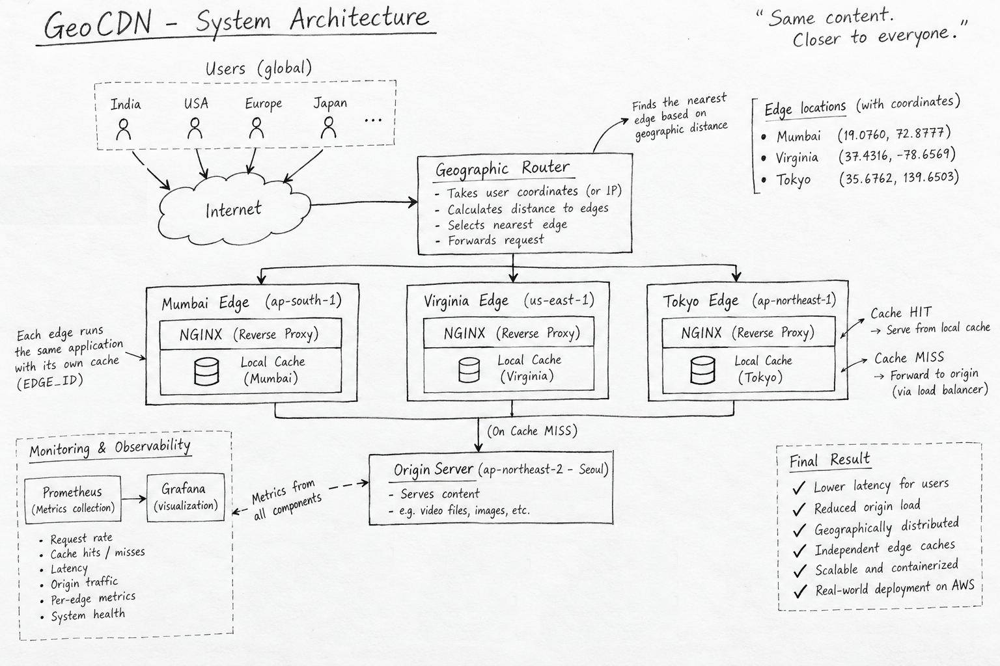
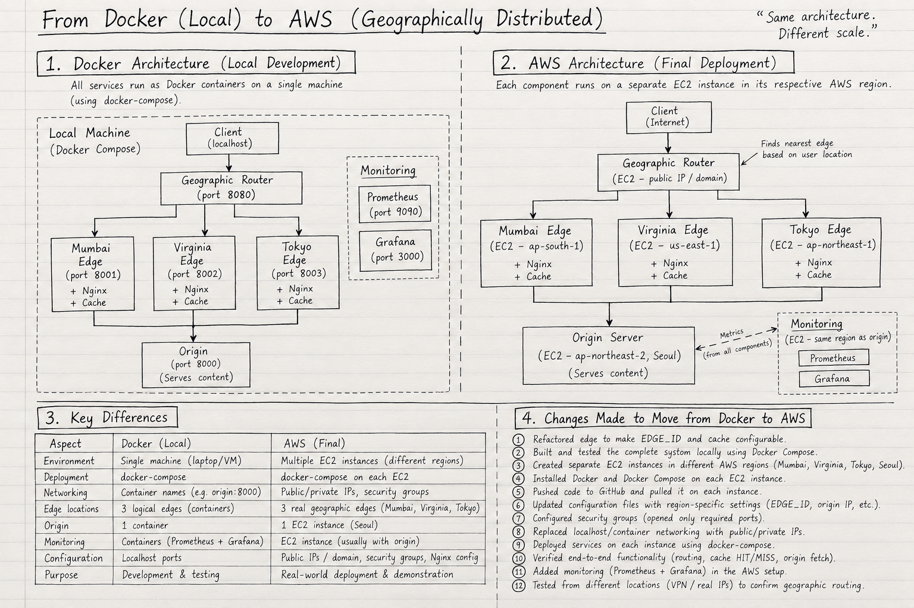
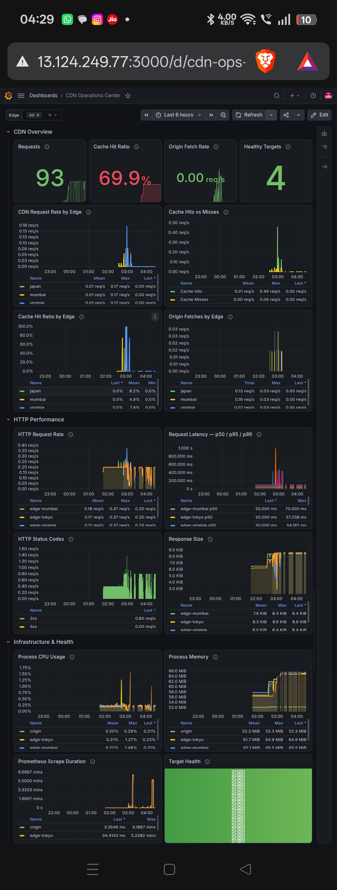
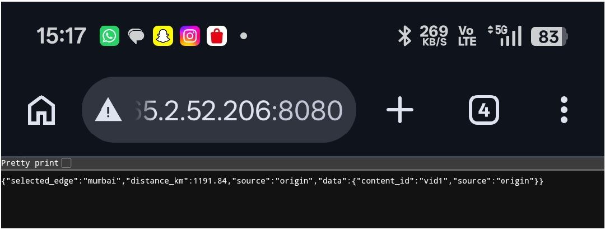
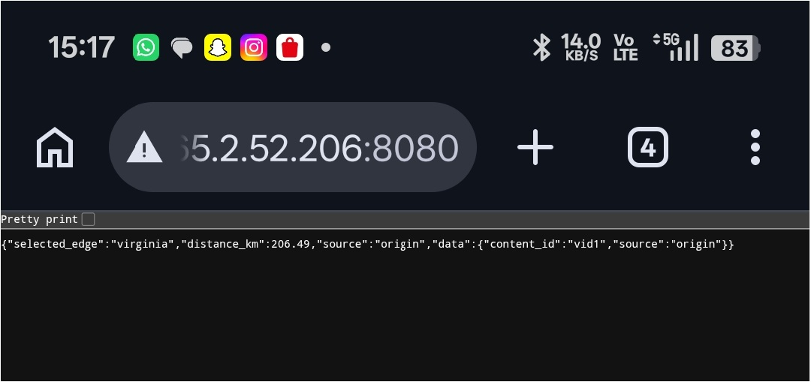
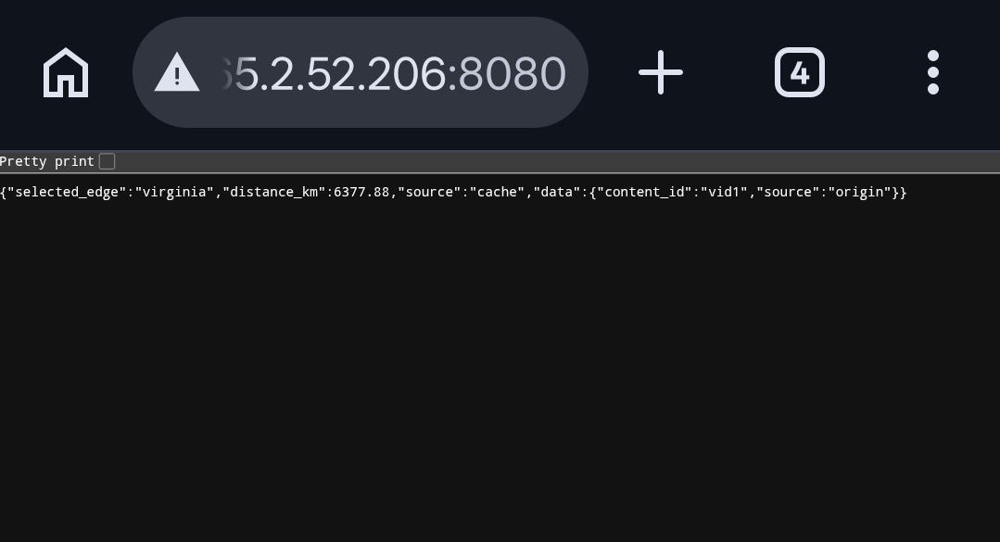

# 🌍 GeoCDN — A Geographically Distributed CDN Simulator

> **A Dockerized, geographically distributed Content Delivery Network that intelligently routes users to the nearest edge location, serves cached content locally, and falls back to a load-balanced origin only on cache misses.**



---

## 🚀 Overview

Traditional client-server architectures send every request back to a centralized origin server.

That works—but as users become geographically distributed, repeatedly fetching the same content from a distant origin introduces unnecessary **latency, bandwidth consumption, and origin load**.

This project explores how a **Content Delivery Network (CDN)** addresses that problem.

The system implements a simplified geographically distributed CDN with:

* 🌍 **Geographic edge selection**
* ⚡ **Independent edge caches**
* 🔄 **Reverse proxying**
* 🏠 **Centralized origin infrastructure**
* ⚖️ **Origin-side load balancing**
* 🐳 **Docker-based deployment**
* ☁️ **AWS multi-region deployment**
* 📊 **Prometheus + Grafana observability**
* 🗺️ **Geographic request visualization**

The core idea is simple:

```text
                 ┌─────────────────┐
                 │      User       │
                 └────────┬────────┘
                          │
                          ▼
                 ┌─────────────────┐
                 │  Geo Router     │
                 │                 │
                 │ Find nearest    │
                 │ edge location   │
                 └────────┬────────┘
                          │
            ┌─────────────┼─────────────┐
            │             │             │
            ▼             ▼             ▼
       ┌─────────┐   ┌─────────┐   ┌─────────┐
       │ Mumbai  │   │ Virginia│   │  Tokyo  │
       │  Edge   │   │  Edge   │   │  Edge   │
       │ + Cache │   │ + Cache │   │ + Cache │
       └────┬────┘   └────┬────┘   └────┬────┘
            │             │             │
            │             │             │
            └─────────────┼─────────────┘
                          │
                     Cache MISS
                          │
                          ▼
                 ┌─────────────────┐
                 │ Origin Load     │
                 │ Balancer        │
                 └────────┬────────┘
                          │
                    ┌─────┴─────┐
                    ▼           ▼
               ┌────────┐  ┌────────┐
               │Origin 1│  │Origin 2│
               └────────┘  └────────┘
```

---

# 🎯 Project Goals

The project was built to demonstrate the core architecture and behavior of a CDN rather than simply deploying a web server behind a cache.

The main objectives were:

### 1. Geographic routing

Determine which edge location is closest to a user based on their geographic coordinates.

### 2. Distributed caching

Give every edge its **own independent cache**, rather than maintaining one globally shared cache.

### 3. Cache-aware request handling

Serve frequently requested content directly from the selected edge whenever possible.

### 4. Origin protection

Ensure that cache hits never need to contact the origin.

### 5. Origin load balancing

When an edge experiences a cache miss, forward the request to an origin load balancer which distributes the request among backend origin servers.

### 6. Observability

Expose metrics that make cache behavior, latency, request volume, origin traffic, and errors measurable.

### 7. Real-world deployment

Move the logical edge locations from Docker containers running locally to geographically separated AWS infrastructure.

---

# 🧠 The Architecture

The final system consists of **four major layers**:

```text
                 ┌───────────────────────────┐
                 │           User            │
                 └─────────────┬─────────────┘
                               │
                               ▼
                 ┌───────────────────────────┐
                 │      Geographic Router    │
                 │                           │
                 │ User Coordinates          │
                 │          ↓                │
                 │ Distance Calculation      │
                 │          ↓                │
                 │ Nearest Edge Selection    │
                 └─────────────┬─────────────┘
                               │
               ┌───────────────┼───────────────┐
               │               │               │
               ▼               ▼               ▼
        ┌────────────┐  ┌────────────┐  ┌────────────┐
        │   Mumbai   │  │  Virginia  │  │    Tokyo   │
        │    Edge    │  │    Edge    │  │    Edge    │
        │            │  │            │  │            │
        │ Reverse    │  │ Reverse    │  │ Reverse    │
        │ Proxy      │  │ Proxy      │  │ Proxy      │
        │     +      │  │     +      │  │     +      │
        │ Local Cache│  │ Local Cache│  │ Local Cache│
        └─────┬──────┘  └─────┬──────┘  └─────┬──────┘
              │                │                │
              │                │                │
              └────────────────┼────────────────┘
                               │
                          Cache MISS
                               │
                               ▼
                    ┌────────────────────┐
                    │   Origin Layer    │
                    │                    │
                    │ Load Balancer      │
                    └─────────┬──────────┘
                              │
                         ┌────┴────┐
                         ▼         ▼
                    ┌────────┐ ┌────────┐
                    │Origin 1│ │Origin 2│
                    └────────┘ └────────┘

                    ┌────────────────────┐
                    │ Prometheus         │
                    │        +           │
                    │ Grafana             │
                    └────────────────────┘
```

---

# 🌎 Geographic Edge Locations

The project models three geographically distributed Points of Presence:

| Edge          | AWS Region       | Approximate Location |
| ------------- | ---------------- | -------------------- |
| 🇮🇳 Mumbai   | `ap-south-1`     | Mumbai, India        |
| 🇺🇸 Virginia | `us-east-1`      | Virginia, USA        |
| 🇯🇵 Tokyo    | `ap-northeast-1` | Tokyo, Japan         |

The origin infrastructure is deployed separately, with **Seoul (`ap-northeast-2`)** used as the origin region in the AWS deployment.

The important architectural distinction is:

> **Mumbai, Virginia, and Tokyo are not simply three cache servers. They represent three geographically distributed edge locations, with caching as a function inside each edge.**

---

# 🔄 Request Lifecycle

Consider a user in India requesting:

```text
/video.mp4
```

### Step 1 — Geographic routing

The user's location is supplied to the geographic router.

For example:

```json
{
  "latitude": 28.6139,
  "longitude": 77.2090
}
```

The router calculates the distance between the user and each configured edge.

```text
User
 │
 ├── Mumbai     → closest
 ├── Virginia   → far
 └── Tokyo      → far
```

The request is therefore sent to **Mumbai**.

---

### Step 2 — Edge cache lookup

The Mumbai edge checks its local cache.

There are two possible outcomes.

#### Cache HIT

```text
User
 │
 ▼
Geo Router
 │
 ▼
Mumbai Edge
 │
 ▼
Cache HIT
 │
 ▼
User
```

The content is returned immediately.

**The origin is never contacted.**

---

### Cache MISS

If the requested object is not present:

```text
User
 │
 ▼
Geo Router
 │
 ▼
Mumbai Edge
 │
 ▼
Cache MISS
 │
 ▼
Origin Load Balancer
 │
 ├──► Origin 1
 │
 └──► Origin 2
 │
 ▼
Response
 │
 ▼
Mumbai Edge
 │
 ├── Store object in local cache
 │
 ▼
User
```

The next request for the same object routed to Mumbai can then be served directly from the cache.

---

# ⚡ Demonstrating the Cache

One of the key demonstrations of the project is:

```text
First request
      ↓
   CACHE MISS
      ↓
   Origin contacted
      ↓
 Object cached
```

Followed by:

```text
Second request
      ↓
    CACHE HIT
      ↓
Origin NOT contacted
      ↓
 Response returned
```

The response exposes the edge and cache state through headers such as:

```http
X-Edge-Location: Mumbai
X-Cache: HIT
```

This makes the CDN behavior directly observable rather than hiding it inside the application.

---

# 🧩 Independent Edge Caches

Each edge maintains its **own cache**.

For example:

```text
Mumbai Cache
└── video.mp4

Virginia Cache
└── empty

Tokyo Cache
└── empty
```

If a user in India requests `video.mp4`:

```text
Mumbai → HIT
```

while a user routed to Virginia may still receive:

```text
Virginia → MISS
```

This is intentional.

The caches are **not one globally shared cache**.

This models the fundamental CDN idea of keeping content close to the users who request it.

---

# ⚖️ Origin Load Balancing

The CDN also demonstrates a second level of distribution.

Geographic routing distributes traffic between **edges**:

```text
                 Geographic Distribution

             ┌───────────────┐
             │  Geo Router   │
             └───────┬───────┘
                     │
          ┌──────────┼──────────┐
          ▼          ▼          ▼
       Mumbai     Virginia     Tokyo
```

The origin load balancer then distributes cache misses between **origin servers**:

```text
                 Origin Distribution

                    Edge
                     │
                     ▼
              ┌─────────────┐
              │ Origin Load │
              │   Balancer  │
              └──────┬──────┘
                     │
              ┌──────┴──────┐
              ▼             ▼
          Origin 1       Origin 2
```

Therefore the project demonstrates **two independent forms of traffic distribution**:

> **Geographic distribution at the edge + load balancing at the origin.**

---

# 🐳 Docker Architecture

The entire system was first developed and validated locally using Docker.

A simplified local deployment looks like:

```text
docker-compose
      │
      ├── router
      │
      ├── edge-mumbai
      │
      ├── edge-virginia
      │
      ├── edge-tokyo
      │
      ├── origin
      │
      ├── load-balancer
      │
      ├── prometheus
      │
      └── grafana
```

Each logical edge runs the same edge application but receives a different configuration such as:

```text
EDGE_ID=mumbai
EDGE_ID=virginia
EDGE_ID=tokyo
```

This allows the same application to represent multiple geographically distributed edges.

---

# ☁️ AWS Deployment

After validating the architecture locally, the logical edge containers were moved onto geographically separated AWS infrastructure.

```text
                         INTERNET
                             │
                             ▼
                     ┌─────────────┐
                     │ Geo Router  │
                     └──────┬──────┘
                            │
            ┌───────────────┼────────────────┐
            │               │                │
            ▼               ▼                ▼
       AWS Mumbai      AWS Virginia      AWS Tokyo
       ap-south-1       us-east-1      ap-northeast-1
            │               │                │
            │               │                │
            └───────────────┼────────────────┘
                            │
                       Cache MISS
                            │
                            ▼
                     AWS Seoul Origin
                     ap-northeast-2
                            │
                     ┌──────┴──────┐
                     ▼             ▼
                 Origin 1      Origin 2
```

Each AWS edge runs the same Dockerized edge service with its region-specific identity and an independent local cache.



---

# 🗺️ Geographic Routing

The geographic router maintains the location of each edge.

Conceptually:

```text
Mumbai
19.0760° N
72.8777° E

Virginia
37.4316° N
-78.6569° E

Tokyo
35.6762° N
139.6503° E
```

For every request, the router:

1. Receives the user's coordinates.
2. Calculates the distance to each edge.
3. Compares the distances.
4. Selects the nearest edge.
5. Forwards the request to that edge.

This is deliberately a simplified geographic routing strategy.

Real CDNs use much more sophisticated mechanisms involving factors such as:

* network topology
* latency
* congestion
* health
* traffic engineering
* Anycast/BGP
* DNS
* capacity

The project's coordinate-based routing provides an understandable model of the fundamental CDN concept.

---


# 📊 Observability

CDN-Prototype V1 includes a dedicated observability layer using **Prometheus** and **Grafana**.

The monitoring stack collects metrics from the Origin Server and all three CDN Edge Servers, allowing the system to be monitored centrally from a single dashboard.

---

## Observability Architecture

```text
                         ┌──────────────────────────┐
                         │        Grafana            │
                         │   CDN Operations Center   │
                         └────────────┬─────────────┘
                                      │
                        Prometheus Data Source (PromQL)
                                      │
                         ┌────────────▼─────────────┐
                         │       Prometheus          │
                         │    Monitoring Instance    │
                         └──────┬──────┬──────┬──────┘─────────┐
                                │      │      │                │
                    ┌───────────┘      │      └───────────┐    └───────────────┐
                    │                  │                  │                    │ 
             ┌──────▼──────┐    ┌──────▼──────┐    ┌──────▼──────┐    ┌────────▼────────┐
             │ Mumbai Edge │    │ Tokyo Edge  │    │Virginia Edge│    │  Origin Server  │
             │   :8001     │    │   :8001     │    │   :8001     │    │      :8000      │
             └─────────────┘    └─────────────┘    └─────────────┘    └─────────────────┘        
```

Prometheus periodically scrapes the `/metrics` endpoint exposed by each service.

---

## Components

### Prometheus

Prometheus runs on the dedicated monitoring EC2 instance.

Its responsibilities are:

- Scraping metrics from all CDN components
- Storing time-series metrics
- Providing a query interface using PromQL
- Tracking target health
- Supplying the metrics used by Grafana

The Prometheus configuration is located at:

```text
prometheus/
└── prometheus.yml
```

The monitoring deployment is defined in:

```text
docker-compose-monitoring.aws.yml
```

---

### Grafana

Grafana runs alongside Prometheus on the monitoring EC2 instance.

Grafana uses Prometheus as its data source and provides the **CDN Operations Center** dashboard.

The dashboard provides a centralized view of:

- CDN request volume
- Cache performance
- Origin fetch activity
- Request latency
- HTTP status codes
- Response sizes
- CPU and memory usage
- Prometheus target health

---

## Metrics Collection

The Edge Servers use:

```python
from prometheus_fastapi_instrumentator import Instrumentator

Instrumentator().instrument(app).expose(app)
```

This automatically exposes application-level HTTP metrics through:

```text
/metrics
```

The Origin Server also uses the Prometheus FastAPI Instrumentator, so its HTTP metrics are exposed through the same endpoint.

The custom CDN metrics are defined using the Prometheus Python client.

---

## Custom CDN Metrics

The CDN Edge application defines three custom counters.

### `cdn_requests_total`

Counts the total number of requests received by each CDN Edge.

```text
cdn_requests_total{edge="mumbai"}
cdn_requests_total{edge="japan"}
cdn_requests_total{edge="virginia"}
```

The `edge` label identifies which edge generated the metric.

---

### `cdn_cache_hits_total`

Counts requests that were successfully served from the Redis cache.

```text
cdn_cache_hits_total{edge="mumbai"}
cdn_cache_hits_total{edge="japan"}
cdn_cache_hits_total{edge="virginia"}
```

---

### `cdn_cache_misses_total`

Counts requests that were not found in the Redis cache and therefore required a request to the Origin Server.

```text
cdn_cache_misses_total{edge="mumbai"}
cdn_cache_misses_total{edge="japan"}
cdn_cache_misses_total{edge="virginia"}
```

---

## Automatically Collected HTTP Metrics

`prometheus-fastapi-instrumentator` also exposes HTTP/application metrics.

Important metrics include:

```text
http_requests_total

http_request_duration_seconds_bucket
http_request_duration_seconds_count
http_request_duration_seconds_sum

http_request_duration_highr_seconds_bucket
http_request_duration_highr_seconds_count
http_request_duration_highr_seconds_sum

http_request_size_bytes_count
http_request_size_bytes_sum

http_response_size_bytes_count
http_response_size_bytes_sum
```

These metrics allow the dashboard to measure request rate, latency, request sizes, response sizes, and HTTP traffic behaviour.

---

## Process and Runtime Metrics

Prometheus also collects Python/process-level metrics exposed by the applications.

Examples include:

```text
process_cpu_seconds_total
process_resident_memory_bytes
process_virtual_memory_bytes
process_open_fds
process_max_fds
process_start_time_seconds

python_info
python_gc_collections_total
python_gc_objects_collected_total
python_gc_objects_uncollectable_total
```

These metrics provide basic visibility into the health and resource usage of the running services.

---

## Prometheus Health Metrics

Prometheus itself exposes useful monitoring information such as:

```text
up
scrape_duration_seconds
scrape_samples_scraped
scrape_samples_post_metric_relabeling
scrape_series_added
```

## Prometheus Targets

The monitoring instance scrapes four application targets:

| Target | Endpoint | Purpose |
|---|---|---|
| Mumbai Edge | `http://<MUMBAI-IP>:8001/metrics` | Mumbai CDN edge |
| Tokyo Edge | `http://<TOKYO-IP>:8001/metrics` | Tokyo CDN edge |
| Virginia Edge | `http://<VIRGINIA-IP>:8001/metrics` | Virginia CDN edge |
| Origin | `http://<ORIGIN-IP>:8000/metrics` | Origin server |

The actual EC2 public IP addresses are configured in the AWS-specific Prometheus configuration.

---

## Verifying Prometheus Targets

The active Prometheus targets can be checked from the monitoring instance:

```bash
curl -s http://localhost:9090/api/v1/targets | \
jq '.data.activeTargets[] | {job: .labels.job, health: .health, url: .scrapeUrl}'
```

A healthy deployment should report:

```text
edge-mumbai   → up
edge-tokyo    → up
edge-virginia → up
origin        → up
```

---

## Verifying Metrics Directly

Metrics exposed by an Edge Server can be checked with:

```bash
curl -s http://localhost:8001/metrics
```

To inspect only the custom CDN metrics:

```bash
curl -s http://localhost:8001/metrics | grep '^cdn_'
```

For example:

```text
cdn_requests_total{edge="mumbai"} 2.0
cdn_cache_hits_total{edge="mumbai"} 1.0
cdn_cache_misses_total{edge="mumbai"} 1.0
```

This demonstrates the relationship between requests and cache behaviour.

---

## Cache Hit Ratio

The dashboard calculates cache hit ratio from the custom counters.

Conceptually:

```text
Cache Hit Ratio =
Cache Hits / Total Requests × 100
```

A PromQL expression can be used to calculate the ratio across the CDN:

```promql
sum(rate(cdn_cache_hits_total[$__rate_interval]))
/
sum(rate(cdn_requests_total[$__rate_interval]))
* 100
```

## Infrastructure & Health

This section focuses on runtime and infrastructure health.

Panels include:

- Process CPU Usage
- Process Memory
- Prometheus target health
- Runtime/process metrics

This section helps answer:

> "Are the services and monitoring targets healthy?"

---

## Dashboard Variables

The dashboard includes an `Edge` selector that can be used to filter metrics by Edge.

Available Edge values include:

```text
All
japan
mumbai
virginia
```

Selecting a specific Edge allows its traffic and cache behaviour to be inspected independently.

---

## Observability Flow

The complete monitoring flow is:

```text
Client Request
      │
      ▼
   Router
      │
      ▼
  CDN Edge
      │
      ├──────────────► Redis Cache
      │                    │
      │              Cache Hit
      │                    │
      │                    ▼
      │                 Response
      │
      └──── Cache Miss ────┐
                           ▼
                       Origin
                           │
                           ▼
                       Response
                           │
                           ▼
                      Edge Cache
                           │
                           ▼
                        Client


Meanwhile:

Edge / Origin
      │
      │ /metrics
      ▼
 Prometheus
      │
      │ PromQL
      ▼
   Grafana
      │
      ▼
CDN Operations Center
```

---

## Why Observability Matters

The observability layer makes the CDN behaviour measurable instead of relying only on manual testing.

It provides visibility into:

- How many requests the CDN receives
- Which Edge receives traffic
- How often requests are served from cache
- How often the Origin must be contacted
- How request latency changes
- What HTTP responses are being generated
- How large responses are
- Whether monitoring targets are reachable
- CPU and memory behaviour of the services

This allows CDN-Prototype V1 to be evaluated not only as a functional system, but also as a system whose behaviour can be measured and analyzed.

---

## AWS Deployment

For AWS, the observability stack is deployed separately from the individual CDN services.

The repository contains an AWS-specific monitoring Compose file:

```text
docker-compose-monitoring.aws.yml
```

The monitoring instance runs:

```text
Prometheus
Grafana
```

while the other EC2 instances run their respective CDN components.

The architecture therefore separates:

```text
Application Infrastructure
        +
Monitoring Infrastructure
```

This keeps monitoring centralized while allowing the Origin and Edge services to remain independently deployed.

---

## V1 Observability Stack

```text
FastAPI
   │
   ├── prometheus-fastapi-instrumentator
   │
   └── custom Prometheus counters
             │
             ▼
        /metrics
             │
             ▼
        Prometheus
             │
             ▼
          Grafana
             │
             ▼
   CDN Operations Center
```

**Observability stack:**

- **Prometheus** — metrics collection and time-series storage
- **Grafana** — visualization and dashboarding
- **prometheus-fastapi-instrumentator** — automatic FastAPI HTTP metrics
- **prometheus_client** — custom CDN metrics
- **PromQL** — metric querying and dashboard calculations

---

## V1 Status

The observability layer completes the monitoring side of CDN-Prototype V1.

The final V1 system therefore consists of:

```text
Router
   │
   ├── Mumbai Edge ─── Redis
   │
   ├── Tokyo Edge ──── Redis
   │
   └── Virginia Edge ─ Redis
             │
             ▼
           Origin

             +

       Prometheus
             │
             ▼
          Grafana
             │
             ▼
    CDN Operations Center
```




---

# 📱 Real-World Testing

The system was also tested from different geographic network locations.

Requests were generated using:

* 🇮🇳 Indian network connectivity
* 🇺🇸 US VPN endpoint
* 🇫🇷 European VPN endpoint

The resulting responses demonstrated that different geographic inputs could cause requests to be routed toward different edge locations.







The VPN is **not the routing mechanism of the CDN**.

It is only a convenient way of testing behavior from different geographic network locations.

The actual simulator's geographic routing is based on explicit geographic information.

---

# 🧪 Key Demonstrations

The project can demonstrate several important CDN behaviors.

### Geographic routing

```text
Indian coordinates
      ↓
   Mumbai Edge
```

```text
US coordinates
      ↓
  Virginia Edge
```

```text
Japanese coordinates
      ↓
    Tokyo Edge
```

### Cache behavior

```text
Request #1 → MISS → Origin → Cache
Request #2 → HIT  → Cache
```

### Independent caches

```text
Mumbai    → HIT
Virginia  → MISS
Tokyo     → MISS
```

### Origin protection

```text
Cache HIT
   ↓
Origin request = 0
```

### Origin load balancing

```text
Cache MISS
   ↓
Origin Load Balancer
   ├── Origin 1
   └── Origin 2
```

---

# 📁 Project Structure

The repository is organized around the major components of the CDN:

```text
.
├── docs/
│   └── ...
│
├── edge/
│   ├── Dockerfile
│   └── main.py
│
├── nginx/
│   └── nginx.conf
│
├── origin/
│   ├── __pycache__/
│   ├── Dockerfile
│   ├── main.py
│   └── tempCodeRunnerFile.py
│
├── prometheus/
│   └── prometheus.yml
│
├── router/
│   ├── __pycache__/
│   ├── geoip/
│   │   └── GeoLite2-City.mmdb
│   ├── Dockerfile
│   └── main.py
│
├── .gitignore
├── docker-compose-monitoring.aws.yml
├── docker-compose-mumbai-edge.aws.yml
├── docker-compose-origin.aws.yml
├── docker-compose-router.aws.yml
├── docker-compose-tokyo-edge.aws.yml
├── docker-compose-virginia-edge.aws.yml
├── docker-compose.yml
├── IPs.txt
├── README.md
└── requirements.txt```

> The exact filenames/directories above should be kept synchronized with the actual repository structure.
```
---

# 🛠️ Technology Stack

| Layer                   | Technology               |
| ----------------------- | ------------------------ |
| Application             | Python                   |
| API / Services          | FastAPI                  |
| Reverse Proxy           | Nginx                    |
| Containerization        | Docker                   |
| Container Orchestration | Docker Compose           |
| Geographic Routing      | Coordinate-based routing |
| Edge Cache              | Redis                    |
| Cloud Infrastructure    | AWS EC2                  |
| Monitoring              | Prometheus               |
| Visualization           | Grafana                  |
| Version Control         | Git / GitHub             |

---

# ▶️ Running Locally

Clone the repository:

```bash
git clone <repository-url>
cd <repository-name>
```

Build the containers:

```bash
docker compose build
```

Start the system:

```bash
docker compose up -d
```

Check running containers:

```bash
docker ps
```

View logs:

```bash
docker compose logs -f
```

Stop the system:

```bash
docker compose down
```

> Use the repository's actual Compose filenames/commands if the final deployment uses multiple Compose files.

---

# 🔍 Testing the CDN

A basic cache test can be performed by requesting the same resource twice.

### First request

```bash
curl <endpoint>
```

Expected behavior:

```text
X-Cache: MISS
```

### Second request

```bash
curl <endpoint>
```

Expected behavior:

```text
X-Cache: HIT
```

The second request should be served by the selected edge without generating another origin request.

---

# 🔐 Security Considerations

The AWS deployment follows several basic security principles:

* SSH access should be restricted to the administrator's IP.
* Public traffic should expose only required application ports.
* Origin servers should not be unnecessarily exposed to the public Internet.
* Monitoring endpoints should not be publicly accessible without appropriate protection.
* AWS credentials should not be hardcoded into containers or source code.
* AWS IAM roles should be preferred where AWS API access is required.
* HTTPS should be used for a public-facing deployment.

---

# 🧭 Project Evolution

This project evolved incrementally rather than being designed as a geographically distributed CDN from the beginning.

### Stage 1 — CDN-like caching system

The original architecture was essentially:

```text
Client
  ↓
Edge / Proxy
  ↓
Cache
  ↓
Load Balancer
  ↓
Backend 1 / Backend 2
```

This established the basic concepts of:

* reverse proxying
* caching
* cache hits/misses
* origin serving
* load balancing

### Stage 2 — Multiple logical edges

The edge was refactored so that the same service could represent different edge locations.

```text
edge-mumbai
edge-virginia
edge-tokyo
```

Each edge received its own cache.

### Stage 3 — Geographic routing

A geographic router was introduced to select an appropriate edge based on user coordinates.

### Stage 4 — AWS multi-region deployment

The logical edge locations were deployed onto geographically separated AWS EC2 instances in Mumbai, Tokyo, and Virginia, with the origin hosted in Seoul.

### Stage 5 — Observability

A dedicated monitoring EC2 instance was introduced with Prometheus and Grafana.
Prometheus scrapes metrics from all three edges and the origin.

### Stage 6 — Visualization

A geographic visualization was introduced to make the routing and cache behavior understandable at a glance.

### Stage 7 — Monitoring dashboard

A Grafana CDN Operations Center dashboard was created to visualize request traffic, cache behavior, origin traffic, HTTP performance, infrastructure health, and per-edge behavior.

This progression transformed the original cache/reverse-proxy system into a **geographically distributed CDN simulator**.

---

# 💡 What This Project Demonstrates

This project is more than a caching application.

It demonstrates several distributed-systems and cloud-computing concepts working together:

### Geographic distribution

Requests are directed toward infrastructure geographically closer to the user.

### Distributed caching

Each edge maintains its own copy of frequently requested content.

### Hierarchical traffic distribution

Traffic is distributed first geographically and then across origin backends.

### Fault isolation

An edge cache can continue serving content without contacting the origin when the requested object is already cached.

### Containerized infrastructure

The architecture can be reproduced locally using Docker before being deployed onto cloud infrastructure.

### Cloud deployment

The same logical architecture can be mapped onto physically separated AWS regions.

### Observability

Prometheus and Grafana provide visibility into the behavior of the distributed system.

---

# 🏁 V1 Status

**CDN-Prototype V1 — COMPLETE**

V1 successfully demonstrates:

- Geographic request routing
- Three geographically distributed edge locations
- Independent Redis-based edge caches
- Cache HIT/MISS behavior
- Origin fallback
- Origin infrastructure
- Dockerized services
- AWS multi-region deployment
- Prometheus monitoring
- Grafana visualization
- Per-edge observability
- HTTP performance monitoring

  
# ⚠️ Limitations

This project intentionally simplifies several aspects of production CDN infrastructure.

### Geographic routing is simplified

The router primarily uses geographic distance rather than real network latency, topology, congestion, or traffic engineering.

### Cache invalidation is simplified

A production CDN requires sophisticated cache invalidation and TTL strategies.

### Limited edge locations

The project models only three edge locations.

### Simplified origin infrastructure

The origin architecture is designed primarily for demonstrating load balancing and CDN behavior rather than production-scale redundancy.

### Educational control plane

The geographic router acts as an educational representation of CDN traffic steering rather than replacing technologies such as Anycast, BGP, DNS-based traffic management, or commercial CDN control planes.

These limitations are intentional—they keep the architecture understandable while still demonstrating the fundamental mechanisms behind a CDN.

---

# 🔮 Future Improvements

Possible extensions include:

* IP-based automatic geolocation
* Real latency-based edge selection
* Health-aware routing
* Edge failover
* TTL-based cache expiration
* Cache invalidation APIs
* Cache warming
* HTTPS and custom DNS
* More AWS regions
* Private networking between origin and monitoring infrastructure
* Automated deployment using CI/CD
* Autoscaling edge infrastructure
* CDN performance benchmarking
* Cost-aware routing
* Anycast/BGP-inspired routing simulation
* More advanced Grafana dashboards

---

# 📈 The Core Experiment

The central experiment of the project can be summarized as:

```text
                   WITHOUT CACHE

User
 ↓
Geo Router
 ↓
Edge
 ↓
Origin
 ↓
Response
```

versus:

```text
                    WITH CACHE

User
 ↓
Geo Router
 ↓
Edge
 ↓
CACHE HIT
 ↓
Response
```

The difference is the entire reason CDNs exist.

By moving frequently requested content closer to users, the system can reduce:

```text
Origin Traffic
      ↓
Network Distance
      ↓
Request Latency
```

while improving:

```text
Content Availability
      +
Scalability
      +
User Experience
```

---

# 🏆 Final Result

The completed system combines:

**Geographic routing + distributed edge caching + reverse proxying + origin load balancing + cloud deployment + observability**

into a single end-to-end architecture.

```text
                        🌍 USERS
                           │
                           ▼
                  ┌─────────────────┐
                  │  GEO ROUTER     │
                  └────────┬────────┘
                           │
             ┌─────────────┼─────────────┐
             ▼             ▼             ▼
          🇮🇳 Mumbai     🇺🇸 Virginia    🇯🇵 Tokyo
             │             │             │
          ┌──▼──┐       ┌──▼──┐       ┌──▼──┐
          │CACHE│       │CACHE│       │CACHE│
          └──┬──┘       └──┬──┘       └──┬──┘
             │             │             │
             └─────────────┼─────────────┘
                           │
                       CACHE MISS
                          │
                          ▼           
                        Origin     

          ┌───────────────────┐
          │     Prometheus    │
          │         +         │
          │      Grafana      │
          └───────────────────┘
```

> **The project started as a cache/reverse-proxy system and evolved into a geographically distributed CDN simulator that demonstrates how modern CDNs bring content closer to users while reducing unnecessary origin traffic.**

---

## 👨‍💻 Author

**Yuvraj Gupta**

Built as a hands-on exploration of:

`Cloud Computing` · `Distributed Systems` · `CDNs` · `Docker` · `AWS` · `Caching` · `Networking` · `Observability`

---

## ⭐ If you found this project interesting

Feel free to explore the architecture, reproduce the cache HIT/MISS experiments, and experiment with different geographic locations and edge configurations.
